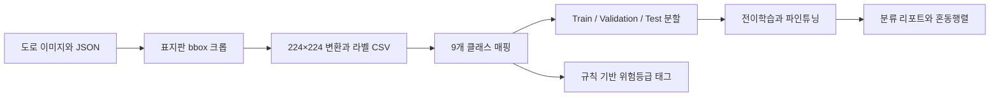
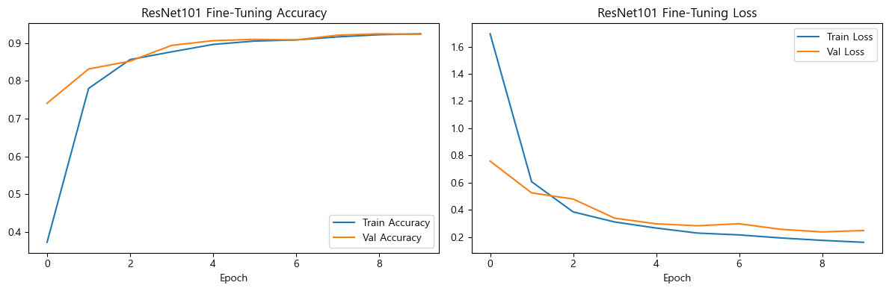
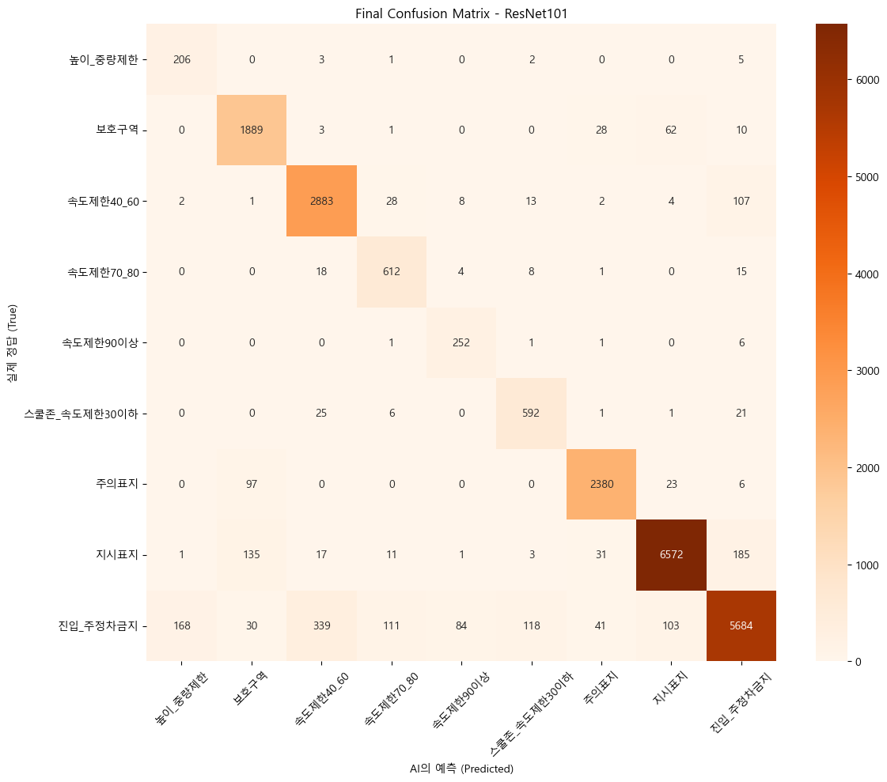

# 한국 도로 표지판 분류 실험

**2026년 1학기 · 3학년 1학기 · 머신러닝(2) 기말 개인 프로젝트**

AI Hub의 국내 도로 영상 데이터에서 표지판 영역을 추출하고, **9개 범주의 이미지 분류를 위해 CNN 모델 4종을 학습·비교**했습니다. 데이터 전처리부터 전이학습, 파인튜닝, 클래스별 평가, 추가 증강 실험까지 진행한 기록입니다.

저장된 테스트 결과에서 ResNet101은 **정확도 91.76%, Macro F1 0.87**을 기록했습니다. 성능이 낮았던 모델과 추가 증강 실험도 함께 공개하며, 관측한 결과와 아직 검증하지 않은 원인을 구분합니다.

**기술:** Python, TensorFlow/Keras, OpenCV, pandas, NumPy, scikit-learn, Matplotlib, Seaborn, Jupyter

[실험 노트북](notebooks/traffic_sign_experiments.ipynb) · [최종 발표 자료](docs/final-presentation.pptx) · [실험 해석과 재실행 안내](docs/experiment-notes.md)

## 프로젝트에서 한 일

- **데이터 구조 분석과 라벨 설계:** JSON의 `type`, `shape`, `color`, `text`를 조합해 표지판을 9개 범주로 매핑했습니다.
- **전처리 파이프라인 구현:** `traffic_sign` 객체를 골라 bounding box로 자르고, 224×224 이미지와 라벨 CSV를 생성했습니다.
- **모델 비교:** ResNet50, ResNet101, MobileNetV2, VGG16에 ImageNet 전이학습과 파인튜닝을 적용했습니다.
- **학습 환경 구성:** GPU 환경, `mixed_float16`, `tf.data` 병렬 처리와 prefetch를 적용하고, 클래스 불균형에 대응하기 위해 class weight를 사용했습니다.
- **결과 분석:** 정확도뿐 아니라 클래스별 Precision·Recall·F1, 혼동행렬, 학습 곡선으로 예측 편중과 오분류를 확인했습니다.
- **추가 실험:** ResNet101에 회전·줌·대비·이동 증강을 추가한 별도 학습 설정을 실험하고 기본 설정과 비교했습니다.

## 문제와 접근

프로젝트의 출발점은 국내 도로 표지판을 분류하고, 표지판 종류에 따라 주의가 필요한 정도를 함께 표현해 보는 것이었습니다. 학습한 모델은 **잘라낸 표지판 이미지의 클래스를 예측**합니다. 전체 도로 사진에서 표지판 위치를 자동으로 찾는 탐지기는 구현 범위에 포함하지 않았습니다.

위험등급은 CNN이 사고 확률을 학습한 결과가 아니라, 라벨을 만들 때 클래스에 부여한 **프로젝트 자체의 규칙 기반 태그**입니다. `고위험·위험·주의·보통·안전`의 5단계를 사용하며, 실제 운전 안전성이나 사고 가능성을 검증한 지표는 아닙니다.



## 데이터 구성

출처는 발표 자료에 명시한 **AI Hub 「신호등/도로표지판 인지 영상(수도권)」**입니다. 아래 수량은 전체 AI Hub 데이터셋의 규모가 아니라 **노트북 실행 기록에 남아 있는 이번 실험의 처리량**입니다.

| 단계 | 수량 |
| --- | ---: |
| 원본 JPG 및 대응 JSON | 각각 110,900개 |
| 추출한 표지판 크롭 | 174,106장 |
| 9개 분류 규칙에 해당하지 않아 제외한 크롭 | 21,023장 |
| 분류에 사용한 크롭 | 153,083장 |
| 학습 / 검증 / 테스트 | 107,158 / 22,962 / 22,963장 |

클래스 비율을 유지하는 stratified split을 사용했으며, 분할 비율은 약 70:15:15, `random_state=42`입니다. 크롭 단위 분할이므로 동일 원본 사진이나 유사한 주행 프레임이 서로 다른 집합에 포함될 가능성은 별도 점검이 필요합니다.

| 프로젝트 클래스 | 크롭 수 | 규칙 기반 태그 |
| --- | ---: | --- |
| 높이_중량제한 | 1,452 | 보통 |
| 보호구역 | 13,282 | 고위험 |
| 속도제한40_60 | 20,320 | 주의 |
| 속도제한70_80 | 4,382 | 보통 |
| 속도제한90이상 | 1,744 | 주의 |
| 스쿨존_속도제한30이하 | 4,312 | 고위험 |
| 주의표지 | 16,702 | 주의 |
| 지시표지 | 46,373 | 안전 |
| 진입_주정차금지 | 44,516 | 위험 |

클래스명은 당시 코드의 이름을 유지했습니다. 예를 들어 `스쿨존_속도제한30이하`는 특정 속도·형태·색상 조건으로 만든 대리 라벨이며, 실제 스쿨존 여부를 별도 검증한 라벨은 아닙니다.

## 저장된 실험 결과

**테스트 크롭 22,963장에 대한 제출 노트북의 저장 출력입니다. 이번 포트폴리오 정리에서 재학습하거나 재평가한 수치가 아닙니다.** 모델별 전처리와 추가 실험 설정에 차이가 있어, 이 결과만으로 모델 구조의 일반적인 우열을 단정할 수는 없습니다.

| 실험 | Test Accuracy | Macro F1 | 관측 내용 |
| --- | ---: | ---: | --- |
| ResNet50 파인튜닝 | 90.57% | 0.86 | 워밍업 이후 파인튜닝으로 분류 성능 개선 |
| **ResNet101 파인튜닝** | **91.76%** | **0.87** | 저장된 비교 실험 중 가장 높은 정확도 |
| ResNet101 추가 증강 설정 | 77.07% | 0.66 | 기본 ResNet101 대비 14.69%p 낮음 |
| VGG16 파인튜닝 | 29.08% | 0.05 | 테스트 예측이 `진입_주정차금지`에 집중 |
| MobileNetV2 파인튜닝 | 0.94% | 0.00 | 테스트 예측이 `높이_중량제한`에 집중 |

Macro F1은 저장된 리포트의 소수 둘째 자리 표시값입니다. 발표 자료 일부의 ResNet50 정확도 `90.62%`와 달리, README는 노트북의 최종 평가 출력 `90.57%`를 사용합니다. 이 기준에서 ResNet101의 정확도 차이는 **+1.19%p**입니다.

### ResNet101 학습 곡선



### ResNet101 혼동행렬



두 그림은 제출 노트북의 저장된 출력에서 추출했습니다. `스쿨존_속도제한30이하` 클래스의 Precision은 ResNet50 0.68에서 ResNet101 0.80으로 달라졌으며, Recall은 두 모델 모두 0.92였습니다. 반면 `높이_중량제한`은 ResNet101에서도 Precision 0.55로 추가 개선이 필요했습니다.

## 실험에서 확인한 점과 다음 과제

**평균 정확도만으로는 예측 편중을 알기 어렵습니다.** VGG16과 MobileNetV2의 분류 리포트·혼동행렬을 통해 단일 클래스에 예측이 집중되는 현상을 확인했습니다. 다만 이를 경량 모델의 표현력이나 class weight 하나의 문제로 확정하지 않고, 입력 전처리부터 다시 비교할 필요가 있습니다.

**추가 증강 실험에서는 여러 조건이 함께 바뀌었습니다.** 기본 모델에도 밝기·대비 증강이 있었고, 추가 실험에서는 기하학적 증강 외에 전처리, 배치 크기, 학습률과 미세조정 범위도 달랐습니다. 따라서 성능 하락을 증강만의 효과로 해석하지 않습니다.

후속 작업은 모델별 입력 전처리 통일, 원본 이미지·주행 구간 기준 분할, 한 번에 하나의 조건을 바꾸는 비교 실험을 우선으로 잡았습니다. 표지판 탐지기와 OCR 연계는 그 이후의 확장 방향입니다. 코드에서 확인한 구체적인 차이는 [실험 해석 문서](docs/experiment-notes.md)에 정리했습니다.

## 파일 구성과 실행 안내

```text
Korean-Traffic-Sign-Classification/
├── README.md
├── requirements.txt
├── .gitignore
├── notebooks/
│   └── traffic_sign_experiments.ipynb
├── docs/
│   ├── final-presentation.pptx
│   └── experiment-notes.md
└── assets/
    ├── resnet101-learning-curves.png
    └── resnet101-confusion-matrix.png
```

노트북과 발표 자료는 **파일 이름만 정리한 제출 원본**이며, 노트북의 코드·실행 출력과 발표 슬라이드는 유지했습니다. README와 실험 해석 문서는 포트폴리오 정리 과정에서 새로 작성했습니다.

노트북에는 로컬 절대 경로, 기존 체크포인트 로드, 이전 세션 변수에 의존하는 실험 셀이 있습니다. 재실행하려면 데이터를 별도로 준비하고 경로와 셀 실행 순서를 조정해야 합니다. 데이터 원본·전처리 이미지·분할 CSV·학습 가중치·독립 테스트 이미지 파일은 제공된 프로젝트 폴더에 없어 이 저장소에 포함하지 않았습니다.

`requirements.txt`는 import에 근거한 패키지 목록이며, 당시 환경을 복원하는 버전 고정 파일은 아닙니다. 상세 준비 사항은 [재실행 안내](docs/experiment-notes.md#재실행-준비)를 확인하세요.

## 자료 출처

- [AI Hub](https://www.aihub.or.kr/)의 「신호등/도로표지판 인지 영상(수도권)」: 발표 자료에 표기된 식별자는 `dataSetSn=188`입니다. 학습 데이터는 AI Hub에서 별도로 이용 신청 및 확인이 필요합니다.
- [최종 발표 자료](docs/final-presentation.pptx) 1~30쪽: 주제 선정, 클래스 설계, 모델 비교와 후속 아이디어의 기록입니다. TAAS 사고 통계는 당시 위험등급 설계의 간접 근거로 제시했으며, 본 저장소에서는 통계 기반 위험 예측 모델의 검증 결과로 사용하지 않습니다.
- [제출 실험 노트북](notebooks/traffic_sign_experiments.ipynb): README의 처리량·평가지표·학습 곡선·혼동행렬의 근거입니다.
